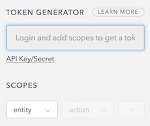

# Deployment

## Prerequisites

The application consists of two repositories: a [Spark-powered Java backend](https://github.com/ibi-group/datatools-server)
and a [Javascript frontend written with React and Redux](https://github.com/ibi-group/datatools-ui).
To install and deploy the application, you will need Java 8 and Maven for the
[datatools-server](https://github.com/ibi-group/datatools-server)
and Node (>= v10 required, >= v14 recommended), npm, yarn and
[mastarm](https://github.com/conveyal/mastarm) for the
[datatools-ui](https://github.com/ibi-group/datatools-ui).

User authentication is done via [Auth0](http://auth0.com). You will need an
Auth0 account and application to use the Data Manager.

Two databases are required for the application:

- [MongoDB](https://www.mongodb.com/) (>=v2.6.4) is used to store application-level data (e.g., persisting projects and feed sources) and
- [PostgreSQL](https://www.postgresql.org/) (>=v9.6) for use by [gtfs-lib](https://github.com/conveyal/gtfs-lib) to store GTFS data.

## Installation and Basic Configuration

Clone the repo and change to the project directory:

```bash
$ git clone https://github.com/ibi-group/datatools-ui.git
$ git clone https://github.com/ibi-group/datatools-server.git
```

Copy the included configuration `env` templates for both the server and UI repos:

```bash
$ cp datatools-ui/configurations/default/env.yml.tmp datatools-ui/configurations/default/env.yml
$ cp datatools-server/configurations/default/env.yml.tmp datatools-server/configurations/default/env.yml
```

You'll then need to supply Auth0 account information (see below) and API keys
for various services used in the application.

The default
[server.yml](https://github.com/ibi-group/datatools-server/blob/dev/configurations/default/server.yml.tmp) for `datatools-server` and
[settings.yml](https://github.com/ibi-group/datatools-ui/blob/dev/configurations/default/settings.yml) for
`datatools-ui` should work out of the box, but you may want to specify
alternative settings files outside of these repositories.
These can be specified as a directory during `datatools-ui` build with mastarm:

```bash
$ mastarm build --config /path/to/configurations/dir
```

AND as individual file args for `datatools-server`:

```bash
$ java -jar target/dt-v1.0.0.jar /path/to/env.yml /path/to/server.yml
```
In `datatools-server:server.yml`, be sure to update the paths for the place where databases will be stored:

```yaml
application:
  data:
    gtfs: /path/to/gtfs/storage
```

### Database setup

#### GTFS data storage
GTFS data storage is handled by whichever standard RDBMS you prefer. However,
the application has been significantly tuned and optimized for PostgreSQL 9, so
we highly recommend using PostgreSQL.

Once PostgreSQL is installed and the service has been started, create the
database for instance by using the CLI [createdb](https://www.postgresql.org/docs/9.1/app-createdb.html):
```bash
$ createdb gtfs_storage_db
```
Pass the URL of the database in the `datatools-server`'s
[env.yml](https://github.com/ibi-group/datatools-server/blob/dev/configurations/default/env.yml.tmp)
(and optionally add additional connection variables):
```yaml
GTFS_DATABASE_URL: jdbc:postgresql://localhost/gtfs_storage_db
# GTFS_DATABASE_USER:
# GTFS_DATABASE_PASSWORD:
```

#### Application data storage
Application data storage (i.e., where projects, feed sources, and feed versions
are stored) is handled by MongoDB. There is no need to manually initialize a
database in MongoDB (MongoDB will handle this automatically if you prefer).
Connection details for MongoDB are also set in the `datatools-server`'s
[env.yml](https://github.com/ibi-group/datatools-server/blob/dev/configurations/default/env.yml.tmp):
```yaml
MONGO_URI: # defaults to localhost:27017 (MongoDB default) if empty
MONGO_DB_NAME: application_db
```

### Setting up Auth0
Auth0 is used for authentication in the application. If you don't need authentication (e.g., if you're running locally or on a secured network), you can set `DISABLE_AUTH` to true for both the server and UI configurations (`env.yml`).

#### Creating account and application (client)
1. Create an [Auth0](https://auth0.com) account (free).
2. Once you've created an Auth0 account, create an application (client) in Auth0
   to use with the Data Manager with the following settings:
    - enable only `Username-Password-Authentication` connections (i.e., turn off
      Google)
    - set `Use Auth0 instead of the IdP to do Single Sign On` to true
    - update the following application- and account-level settings to include
      `http://localhost:9000` (or the domain where the application will be hosted):
        - Account level (Account Settings > Advanced)
            - Allowed logout URLs
        - Application level
            - Allowed Callback URLs
            - Allowed Origins (CORS)
    - keep all other default settings

#### Creating your first user
Create your first Auth0 user through Auth0 web console (Users > Create User). In
addition to an email and password, you'll need to supply the user with the
following default application admin `app_metadata` (`user_metadata` should
remain empty):

```json
{
  "datatools": [{
    "permissions": [
      {
        "type": "administer-application"
      }
    ],
    "subscriptions": [],
    "projects": [],
    "client_id": "your-auth0-client-id"
  }]
}
```

#### Update `env.yml` for server and UI repos
Update the following properties in **both** `env.yml` files to reflect the public Auth0 application settings:

```yaml
AUTH0_DOMAIN: your-auth0-domain.auth.com
AUTH0_CLIENT_ID: your-auth0-client-id
```

Update the following properties in `datatools-server` `env.yml` to reflect the secure Auth0 application settings.

**Note:** for older Auth0 accounts/tenants, it is possible to use the Auth0 secret token, which uses the HS256 algorithm, but newer Auth0 tenants will need to specify the absolute path of their `.pem` file in the `AUTH0_PUBLIC_KEY` property. This public key only needs to be downloaded one time for your Auth0 tenant at `https://[your_domain].auth0.com/pem`.

```yaml
AUTH0_SECRET: your-auth0-client-secret # used for pre-September 2017 Auth0 accounts
AUTH0_PUBLIC_KEY: /location/of/auth0-account.pem # used for post-September 2017 Auth0 accounts
AUTH0_TOKEN: your-auth0-api-token
```

**Note**: to generate the `api_token`, go to Documentation > Management API. After adding scopes, your token will appear in the input field.



To allow for the creation, deletion and editing of users you must generate a token for the following scopes:

- **users**:
    - read, update, create and delete
- **users_app_metadata**:
    - read, update, create and delete`

#### Auth0 Rule Configuration: making app_metadata and user_metadata visible via token (only required for "new" Auth0 accounts/tenants)
If using OIDC-conformant clients/APIs (which appears to be mandatory for new Auth0 tenants), you must set up a custom Auth0 rule to add app_metadata and user_metadata to the user's token (Note: this is not the default for older, "legacy" Auth0 accounts). Go to Rules > Create Rule > empty rule and add the following code snippet. If you'd like the rule to only apply to certain clients, you can keep the conditional block that checks for `context.clientID` value. Otherwise, this conditional block is unnecessary.

```
function (user, context, callback) {
  if (context.clientID === 'YOUR_CLIENT_ID') {
    var namespace = 'http://datatools/';
    if (context.idToken && user.user_metadata) {
      context.idToken[namespace + 'user_metadata'] = user.user_metadata;
    }
    if (context.idToken && user.app_metadata) {
      context.idToken[namespace + 'app_metadata'] = user.app_metadata;
    }
  }
  callback(null, user, context);
}
```

## Building and Running the Application

Install the Javascript dependencies for `datatools-ui` using yarn:

```bash
$ cd datatools-ui
$ yarn
```

Build and deploy `datatools-ui` to s3 using npm script
(which calls [mastarm](https://github.com/conveyal/mastarm)):

```bash
$ npm run deploy -- s3://$S3_BUCKET_NAME/dist
```

Package `datatools-server` using Maven:

```bash
$ cd datatools-server
$ mvn package
```

Deploy `datatools-server` with Java:

```bash
$ java -jar target/dt-v1.0.0.jar /path/to/env.yml /path/to/server.yml
```

`Datatools-server` should now be running at `http://localhost:9000`
(or whatever port you specified in `server.yml`).
`Datatools-ui` assets are obtained from the `dist`
folder relative the url specified in `server.yml` at `application.client_assets_url`.
While running a development server of datatools-ui,
these assets are delivered to the client using budo,
so the links defined in the backend `server.yml` are only used in a production setting.

## Configuring Modules

The application contains a number of optional modules that each require their
own configuration settings and resources. At minimum, each module must be set to
`enabled: true` and may require additional configuration.

**Note:** for `datatools-server` `v3.0.0`, the `editor` and `r5_network` should be
disabled because they have not been refactored to handle updates to the loading
of GTFS data into an RDBMS. Please use `v2.0.0` or wait for releases following
`v3.0.0`.

### Editor

Enables the GTFS Editor module.

#### List of configuration settings

- `MAPZEN_TURN_BY_TURN_KEY`
- `MAPBOX_MAP_ID`
- `MAPBOX_ACCESS_TOKEN`
- `R5_URL` (optional parameter for r5 routing in editor pattern drawing)

### R5 network validation

While the application handles basic validation even without the `r5_network`
module enabled, this module allows for enhanced accessibility- and map-based
validation.

#### List of configuration settings

- `OSM_VEX` - `datatools-server:env.yml` the validator requires the URL of a
running instance of the [OSM vex server](https://github.com/conveyal/vanilla-extract).

### Alerts

Enables the real-time alerts module.

#### List of configuration settings

- `use_extension` - extension key to use for alerts
- `url`
- Requires `gtfsapi` module

### GTFS+ (`gtfsplus`)

Enables the GTFS+ module.

### Deployment

Enables the OTP automated deployments module.

#### List of configuration settings

- `OSM_VEX` - `datatools-server:env.yml`  the validator requires the URL of a
running instance of the [OSM vex server](https://github.com/conveyal/vanilla-extract).

### GTFS API

Supports other modules with API endpoints for getting GTFS entities (routes,
stops, etc.)

#### List of configuration settings

- `load_on_fetch` - whether to load GTFS feeds when new feed is detected
- `load_on_startup` - whether to load GTFS feeds on application startup
- `use_extension` - which extension to connect to
- `update_frequency` - update frequency for GTFS API (in seconds). Comment
  out to disable updates.

## Configuring Extensions

The application supports integration with several third-party resources for
retrieving feeds.

### Integration with [transit.land](https://transit.land/)

Ensure that the `extensions:transitland:enabled` flag is set to `true` in
`config.yml`:

```yaml
extensions:
  transitland:
    enabled: true
    api: https://transit.land/api/v1/feeds
```

### Integration with [TransitFeeds](http://transitfeeds.com/)

Ensure that the `extensions:transitfeeds:enabled` flag is set to `true` in
`config.yml`, and provide your API key:

```yaml
extensions:
  transitfeeds:
    enabled: true
    api: http://api.transitfeeds.com/v1/getFeeds
    key: your-api-key
```
