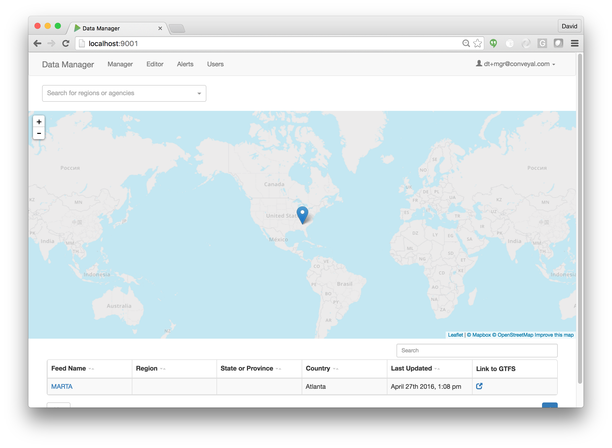

# MTC Transit Data Tools

The MTC Transit Data Tools suite provides web-based tools for creating, managing, evaluating, and publishing transit data, specifically data stored in the General Transit Feed Specification (GTFS) format.

The following documentation is available (see full table of contents at left):

- **User Documentation** covering basic use and operation of the tools
- **Developer Documentation** covering installation/deployment of the software and project development
