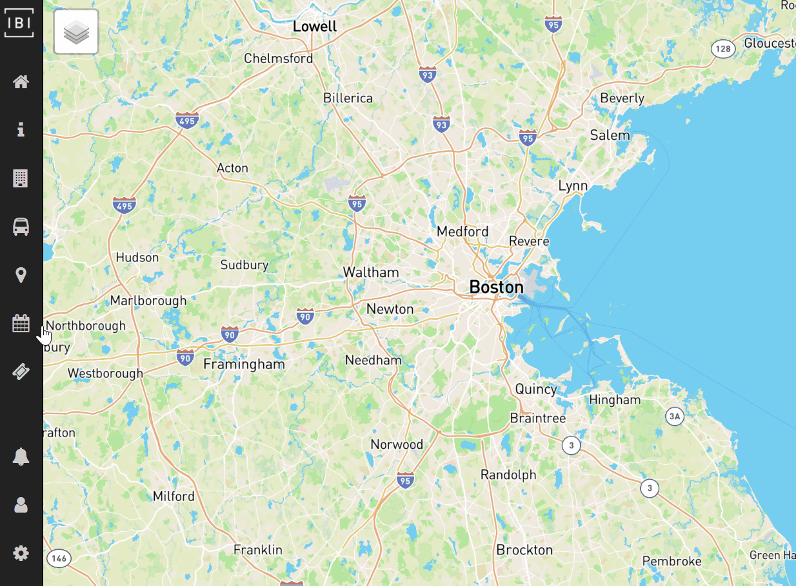
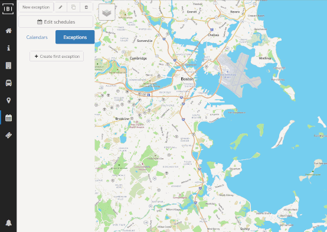

# Calendars

## Editing calendars

To begin editing calendars, click the 📅 button on the lefthand navigation bar.

Choose a calendar from the list to begin editing. To create a new calendar, click `+ New calendar`. **Note:** as with all newly created items (except patterns), the new calendar will not be saved until the save icon (💾) is clicked.

## Calendar details

- **Service ID** - unique ID for the calendar
- **Description** - optional description for calendar (defaults to initial days of week specified)
- **Days of service** - days of week on which the service operates
- **Start/End dates** - the first and last day of that service assigned to the calendar should run

## Editing schedule exceptions

Schedule exceptions allow users to define days where special services should replace the regularly operating calendars. To create a schedule exception, click the `Exceptions` tab and then click `+ New exception` (replaces the "New calendar" button).

## Exception details

- **Name** - name of schedule exception
- **Schedule to run** - the chosen schedule that should replace the regularly operating calendars (see below Exception types)
- **Dates** - one or more dates to which the schedule exception applies

## Exception types

There are a number of built-in exception types (or available schedules to run) that allow for a high degree of flexibility when assigning special services.

- **[Su, M, Tu, W, Th, F, Sa]** - replaces all service for the specified dates with the calendar(s) that operate on the chosen day of the week
- **No service** - indicates that no service of any kind should operated on the specified dates
- **Custom** - replace all service for the specified dates with trips operating on the one or more calendars specified with this option. E.g., run only `holiday` and `holiday-plus` calendar on Thanksgiving Day.
- **Swap** - similar to the **Custom** option, however this option allows for removing one or more specific calendars for the specified dates and/or adding one or more specific calendars. This option is especially useful if only certain routes have altered service on specific dates. For example, a user could remove the `weekday-route-1` calendar and add the `special-route-1` calendar.

## Editing schedules
Click `Edit schedules` to begin creating or editing trips/frequencies for a trip pattern. You will be redirected to the Schedule Editor. For more information on creating schedules for a pattern, see [Trips](schedules).

**Note**: At least one route, pattern and calendar must have been created to edit schedules.

## Tutorial Video: Creating Calendars 
The following video demonstrates the points outlined above. 

<iframe
    width="560" 
    height="315"
    margin-left="auto"
    margin-right="auto"
    src="https://www.youtube.com/embed/Ozvroe7EFHs" 
    frameborder="0" 
    allow="accelerometer; autoplay; encrypted-media; gyroscope; picture-in-picture" 
    allowfullscreen>
</iframe>
