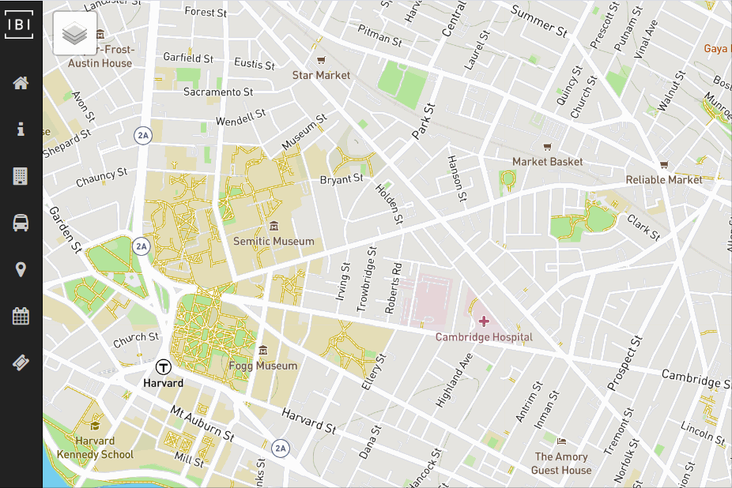
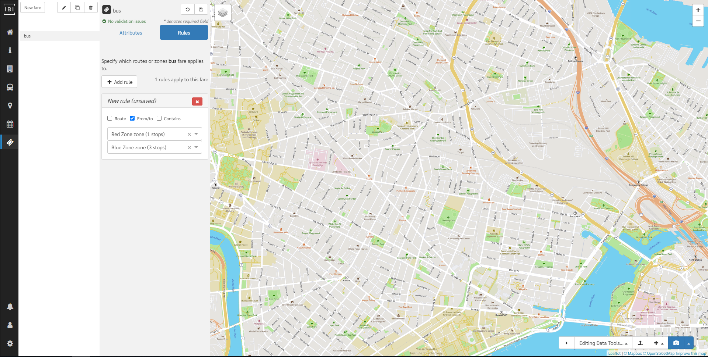
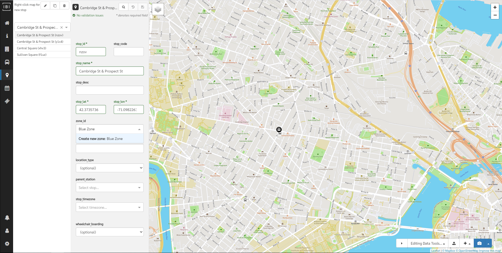
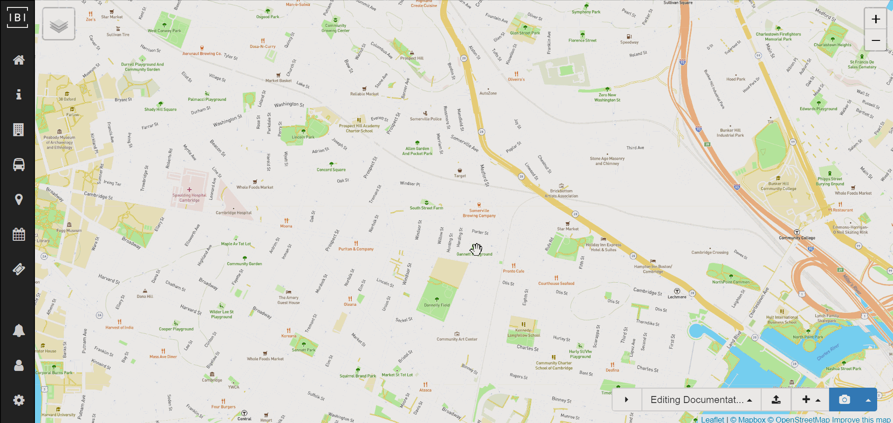

# Fares

## Editing fares

To begin editing fares, click the fare ticket button on the lefthand navigation bar.

Choose a fare from the list to begin editing. To create a new fare, click `+ New fare`. **Note:** as with all newly created items (except patterns), the new fare will not be saved until the save icon (💾) is clicked.

## Fare attributes

Fare attributes describe the basic information about a fare. Full details on fare attributes can be found at the [GTFS specification reference](https://developers.google.com/transit/gtfs/reference/fare_attributes-file).

## Fare rules

To edit fare rules, you must first create and save a fare with attributes. After choosing a fare, click the `Fare rules` tab and define one or more rules for this fare using the following types:

1. **Route** - applies to any itinerary that includes the route
2. **From/to zone** - applies to any itinerary that travels from the origin zone to the destination zone
3. **Contains zone** - applies to any itinerary that passes through *each* `contains` zone

**Note:** fare rules can be tricky, see the [GTFS specification reference](https://developers.google.com/transit/gtfs/reference/fare_rules-file) for more information on how fare rules apply.

## Creating fare zones

To create a fare zone for use in fare rules, you must first select a stop that you would like to include in the zone. Click in the `zone_id` dropdown and begin typing the new `zone_id`. Click `Create new zone: [zone_id]` and then save the stop. Repeat for as many zones as needed.

Once created and assigned to one or more stop, fare zones can be used when defining fare rules for **From/to zone** or **Contains zone**.

