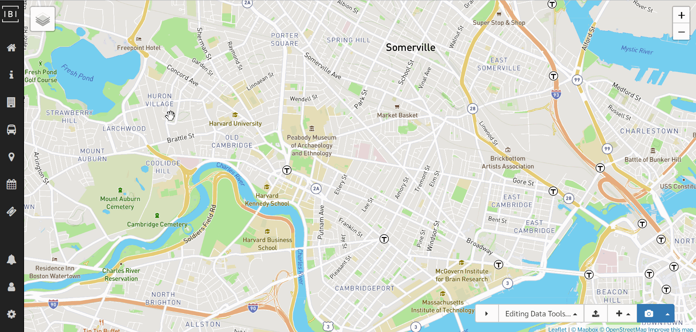
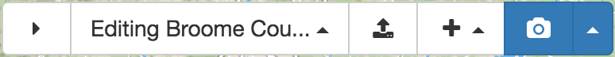

# Introduction

## Getting started

The GTFS Editor (or Editor) allows users to edit GTFS feeds imported from the Data Manager (see [Loading Feed Versions into Editor](../../user/managing-projects-feeds/#loading-feed-versions-into-editor)) or create GTFS feeds completely from scratch.

## Saving in the Editor

When editing routes, stop, calendars, and any other entities in the Editor, you must manually save any changes using the save icon (💾) button to avoid accidental changes. The only exception here is for patterns, which save your changes automatically.

## Navigating the Editor

The primary tables in GTFS (feed info, routes, stops, calendars, and fares) all correspond to items in the lefthand navigation bar, which allow you to create, edit, or delete records for each of these tables.

Some tables are nested underneath these primary tables. Here's how to find them and what they're called in the Editor:

- **[Routes](routes)**
    - **[Trip patterns](patterns)** (shapes and stop times) - allows users to create one or more stop sequences for a given route. For example, a route may have an inbound and outbound trip pattern.
        - **[Schedules](schedules)** (trips and frequencies) - define the trips for a trip pattern. Depending on whether the pattern is timetable- or frequency-based, these will be defined as individual trips or frequency intervals.
- **[Calendars](calendars)**
    - **[Exceptions](calendars/#editing-schedule-exceptions)** (i.e., calendar dates)
- **[Fares](fares)** (fare attributes)
    - **[Fare rules](fares/#fare-rules)**

## Quick access toolbar

In the bottom, righthand corner of the Editor, you'll find the quick access toolbar that has a few convenient features you might need while editing.

From left to right, these functions are:

- Hide the quick access toolbar
- Navigate back to feed source or project in Data Manager
- Upload a zipped routes shapefile to display polylines as a visual aid for drawing trip patterns
- Create any entity (route, stop, calendar, etc.)
- Take snapshot (save point) for current state of data (or revert to previous snapshot)

## GTFS tables/fields supported

For a technical look at which fields are supported by the Editor, check out this [data file](https://github.com/ibi-group/datatools-ui/blob/master/gtfs.yml) which contains a full listing of all of the supported tables and fields in the application.

Are there fields missing that you need? Feel free to contact us at <a href="mailto:transitrealtime@ibigroup.com">transitrealtime@ibigroup.com</a> to see how we might be able to help.
