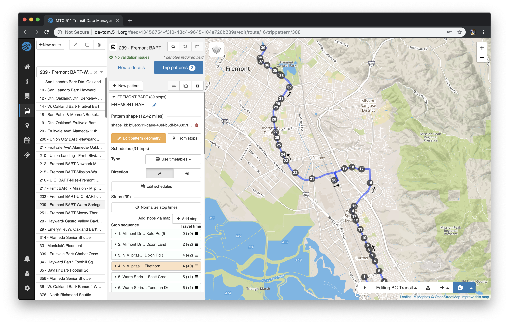
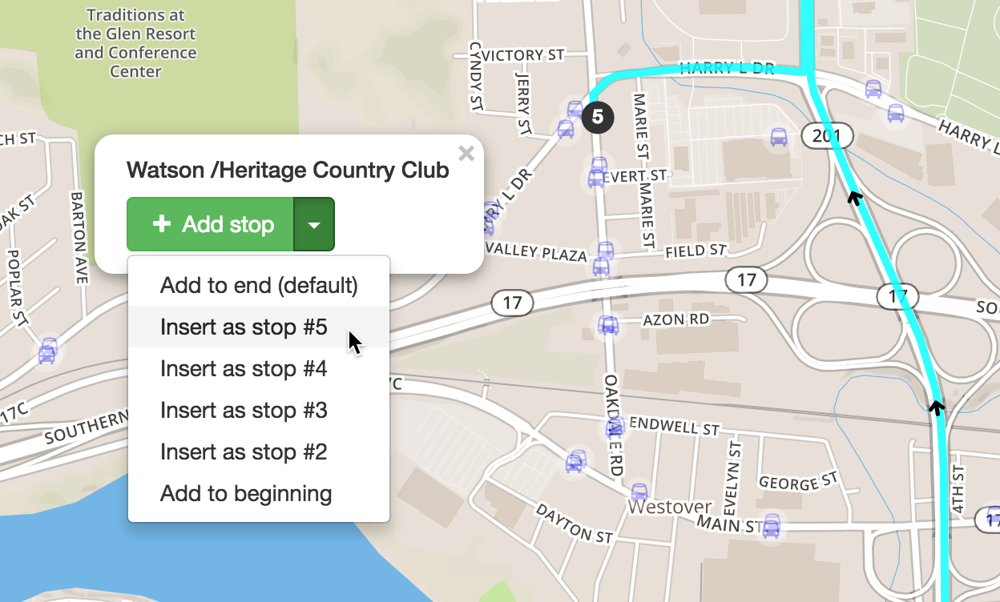
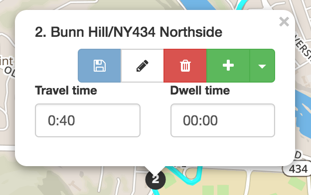
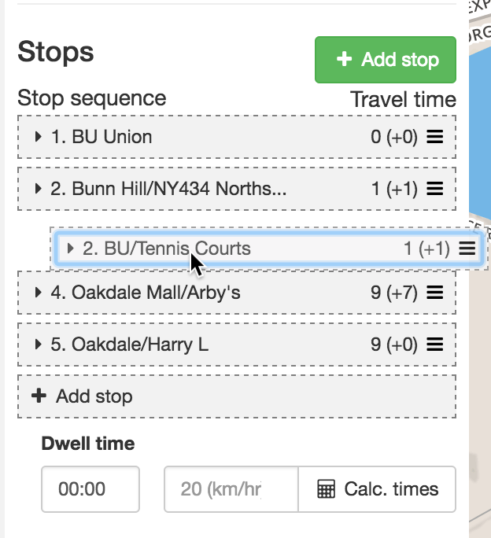
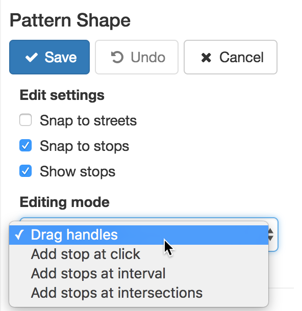

# Trip Patterns

## Editing trip patterns

To begin editing trip patterns (or patterns), first select or create a route. Click the `Trip patterns` tab.

Choose a pattern from the list to begin editing. To create a new pattern, click `+ New pattern`.

## Pattern toolbar

### Zoom to pattern extents
Clicking the 🔍 button (in the top toolbar) with a pattern selected adjusts the map view to show the entire pattern you are editing.

### Duplicate pattern
Creates a duplicate of the active pattern (duplicated pattern name becomes `[Pattern name] copy`) if you need to create a similar, but different trip pattern.

### Reverse pattern
To reverse the sequence of stops for a pattern, click the yellow opposing arrows button. **Note**: this is a destructive action and should usually only be used with Duplicate Pattern.

### Delete pattern

Deletes the active pattern. **Note**: deleted patterns cannot be recovered.

## Pattern details

- **Name** – the name of the trip pattern within the route, for example a service that runs the full length of the route or a service that only runs part of the length of the route.
<!-- TODO: add transitwand to GTFS Editor -->
<!-- - Transitwand id (optional) – the trip pattern can be imported from a Transitwand route trace, if you have one enter the phone id here and click the ‘Load from Transitwand’ box. -->
- **Use timetables/frequencies** - whether the pattern uses timetables, i.e., individual entries for each trip made over the course of a day, or frequencies, which define varying frequencies (or headways) according to time intervals over the course of a day.
- **Direction** - corresponds to the `direction_id` field in GTFS. All trips associated with this pattern will be assigned the direction provided here.

## Editing schedules
Click `Edit schedules` to begin creating or editing trips/frequencies for a trip pattern. You will be redirected to the Schedule Editor. For more information on creating schedules for a pattern, see [Trips](schedules).

## Stop sequence
### Adding stops
To begin constructing a pattern, click `+ Add stop`. You can then search for stops to add by name in the dropdown that appears or zoom into the map and add stops by clicking on them and clicking `+ Add stop`.

As you add stops, the pattern shape will update according to the street network. Keep selecting and adding stops in the sequence the route passes through them until the route is complete.

### Inserting stops mid-sequence
If you realize you have missed a stop from the sequence it can be added in after the fact. When adding via the dropdown, stops can only be added to the end of the sequence; however, if you're adding via the map, you can choose where exactly to insert the stop.

### Pattern stop toolbar
The pattern stop toolbar can be found by clicking the pattern stop in the map view.

- **Save** - saves any edits to the travel and dwell times.
- **Edit** - allows user to begin editing the stop's details (clicking the browser **Back** button will bring you back to editing the pattern). **Note**: be sure you have saved any pattern information before jumping to edit a stop.
- **Remove** - removes the stop from the pattern.
- **Add** - add the stop to the sequence at an additional location. This is useful for patterns that might visit the same stop more than once (e.g., loop routes).

### Changing the order of stops
If a stop is in the wrong order, you can click and drag the stop from the list view into the correct sequence. The sequence displayed on the stop being dragged will only update after being dropped into place.

**Note**: if inserting stops mid-sequence or changing the order of stops, the pattern shape will not update automatically. You must edit the pattern manually or click the `From Stops` button to regenerate the pattern shape from the stops.

### Removing stops
Stops can be removed from the pattern by clicking the red 🗑 button found in the expanded stop card or by clicking the pattern stop on the map view.

## Stop timings
### Calculate timings
The average speed for the route can be used to calculate all the time gaps between stops in one go. Once the stops have been added and the pattern alignment is drawn simply click **Calc. Times** and the time between stops will automatically fill in.

- **Average speed** - average speed (in km/hr) to use when calculating timings
- **Dwell time** – allows you to assign the same dwell time to all stops within a trip
 pattern

### Manual timings
Individual timings for each pattern stop can also be assigned either through expanded the stop card in the list of stops or via clicking the pattern stop on the map view.

- Travel time – the time it took to get from the previous station (should be 00:00 on the first stop of the sequence)
- Dwell time – the time the vehicle rests at the stop

## Tutorial Video
The following video demonstrates how to create patterns as outlined above, in a step by step manner. 
<iframe 
    width="560"
    height="315" 
    src="https://www.youtube.com/embed/ruYYK09MxUc" 
    frameborder="0" 
    allow="accelerometer; autoplay; encrypted-media; gyroscope; picture-in-picture" 
    allowfullscreen>
</iframe>
<!-- TODO: clear pattern stops feature -->
<!-- - Clear pattern – removes stop sequence from pattern -->

## Creating pattern alignments
As mentioned above, pattern shapes will begin to draw automatically as stops are added in sequence. However, if you need to make adjustments to the auto-generated shape, clicking `Edit` will allow you to begin editing the shape segments between stops.

### Basic editing
Once editing a pattern shape, there are a few behaviors you should be aware of:

- Dragging a handle (✕) will create a new alignment between stops or surrounding handles
- Clicking the pattern will add additional handles to the segment
- Clicking added handles will remove them (**Note**: only grey handles can be removed)

### Shape toolbar
#### Before editing
- **Edit** - begin editing the pattern shape
- **Delete** - delete the pattern shape
- **Create** - creates alignment that follows streets from pattern stops

#### While editing
- **Save** - Save changes to pattern shape and leave editing mode.
- **Undo** - Undo last change.
- **Cancel** - Cancel edits and leave editing mode.

### Edit settings
- **Snap to streets** - snaps segments between handles and stops to streets. If unchecked, segments will form straight lines between handles and stops (e.g., for drawing shapes for rail lines).
- **Hide stop handles** - keeps shape segments snapped to stops. If unchecked, stop handles will become draggable. In most cases, this setting should remain checked.
- **Hide inactive segments** - toggles whether to show segments that are not currently being edited. 
- **Show stops** - toggles whether stops are visible because sometimes stop markers can get in the way when trying to draw shapes.
- **Show tooltips** - toggles whether to show tips when hovering over a segment, e.g. "Click to edit segment" or "Click to add control point". 

### Editing modes

There are a few different editing modes that allow for the quick and easy creation of pattern shapes:

- **Drag handles** (default) - drag handles to change the pattern segment between stops. This mode is also in effect during the advanced modes listed below.
- **Add stop at click** - at each click on the map, a new stop is generated and the pattern is extended to this stop.
- **Add stop at interval** - at each click on the map, stops are generated along the auto-generated pattern extended to the map click at the user-defined spacing interval from 100 to 2000 meters.
- **Add stop at intersection** (experimental, not available in all regions) - at each click on the map, stops are generated along the auto-generated pattern extended to the map click according to the user-defined parameters:
    - **Offset from intersection** - distance the stop should be placed from the intersection
    - **Before/after** - whether stop should be placed before or after intersection
    - **Every *n* intersections** - the number of intersections at which each new stop should be placed

**Note**: the last three advanced editing modes should only be used when creating routes in new areas where stops don't already exist.

## Tutorial Video: Editing Patterns 
The following video demonstrates the steps for editing patterns, as outlined above. 
<iframe 
    width="560" 
    height="315" 
    src="https://www.youtube.com/embed/0UgG9pUUSxk" 
    frameborder="0" 
    allow="accelerometer; autoplay; encrypted-media; gyroscope; picture-in-picture" 
    allowfullscreen>
</iframe>
