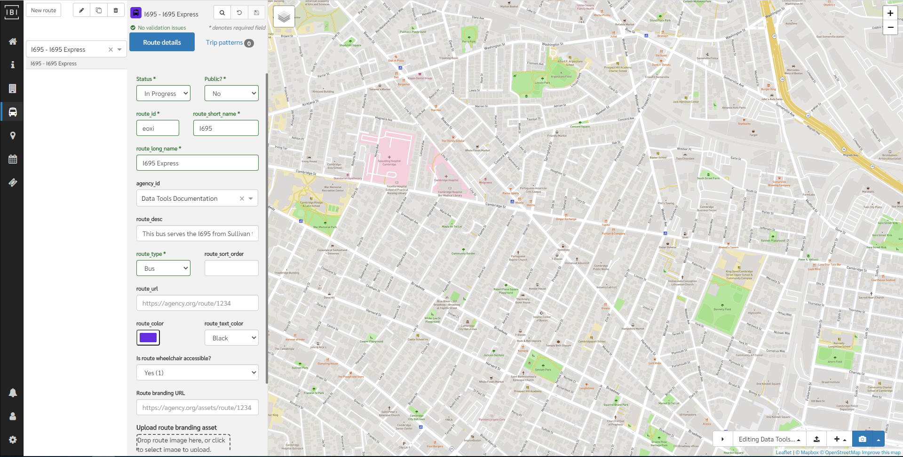

# Routes

## Editing routes

To begin editing routes, click the 🚍 button on the lefthand navigation bar.

Choose a route from the list or search by route name in the dropdown. To create a new route, click `+ New route`. **Note:** as with all newly created items (except patterns), the new route will not be saved until the save icon (💾) is clicked.

## Zoom to route extents
Clicking the 🔍 button (in the top toolbar) with a route selected adjusts the map view to show the entire route (i.e., all patterns) you are editing.

## Route details

Some of the fields to be filled in are required before you can ‘Save and Continue’ and move to the next step, these are:

- **Status** - takes the following values: 
    - **In-Progress** - showing a route has not been completely entered
    - **Pending Approval** - a route has all the information entered and is awaiting a senior person to sign it off
    - **Approved** - all the above stages have been completed
- **Publicly Visible?** - this must be set to "Yes" for the route to be included in a GTFS output. 
- **route_id** - an identifier for the route. A randomly generated ID is provided by default.
- **route_short_name** - name of the service/route, this may just be a number
- **route_long_name** - the full name of the route, often including the origin and destination
- **route_type** - the type of vehicle/transport used on the route

Other fields in this section are optional and do not have to be filled in, these are:

- **agency_id** - the agency identifier from the defined agencies. Generally this field is automatically populated. 
- **route_desc** - a description of the route, do not simply repeat the information in ‘Long name’
- **route_sort_order** - Orders the routes for presentation to GTFS consumers. Routes with smaller route_sort_order values should be displayed first
- **route_url** - a link to a webpage with information on the specific route, such as the timetable
- **route_color** - if a route has a color (for use in trip planners etc) it can be assigned here
- **route_text_color** - if a route has a text color (for use in trip planners etc) it can be assigned here
- **Is route wheelchair accessible?** - Either "Yes", "No", or "No Information"
- **Route branding URL** - a link to a webpage with route branding information
- **Route branding asset** - a route image

Once all the required fields, and any of the desired optional fields, are filled in click `Save`.

## Trip Patterns

Once you've created and saved a route, you can then begin creating trip patterns for the route.

[Learn about editing trip patterns »](patterns)

## Tutorial Video: Creating Routes
The following video demonstrates the editing of a new route outlined above, in a step by step manner. 

<iframe 
    width="560" 
    height="315" 
    src="https://www.youtube.com/embed/WWm_FDmuMsY" 
    frameborder="0" 
    allow="accelerometer; autoplay; encrypted-media; gyroscope; picture-in-picture" 
    allowfullscreen>
</iframe>
