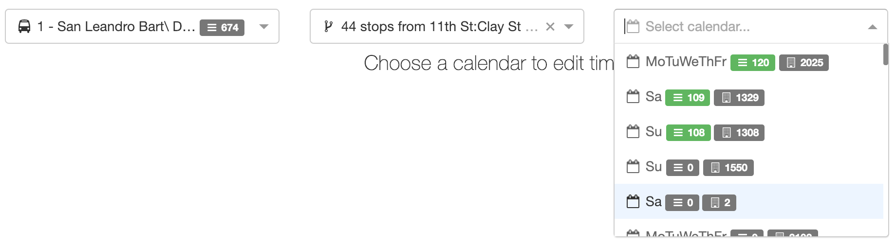
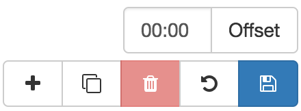
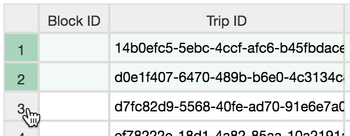
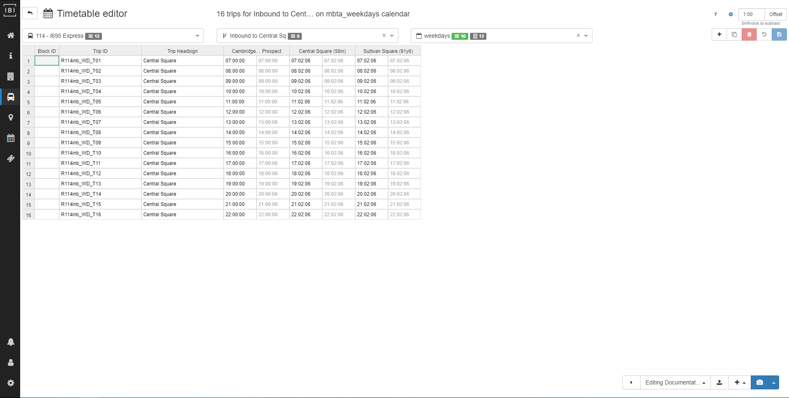
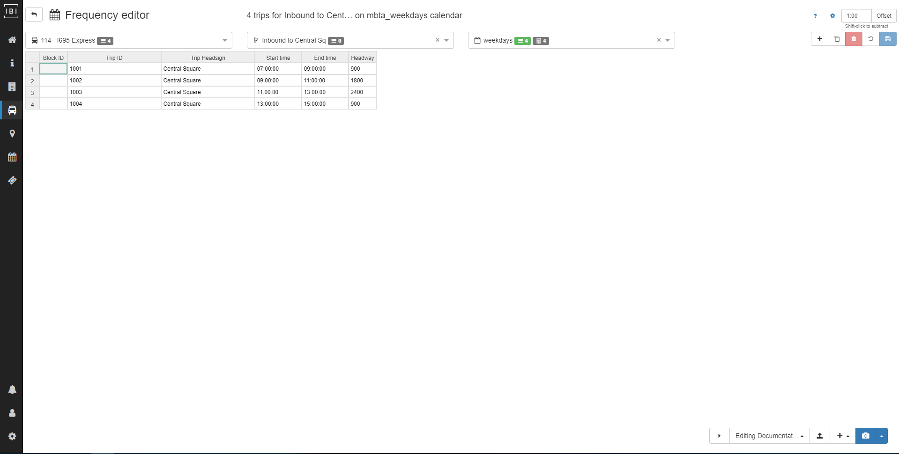

# Trips

## Selecting schedules
The schedule editor allows users to create trips/frequencies for any route, pattern, and calendar combination.  The selectors at the top of the page allow users to navigate between calendars for a given pattern or switch between patterns for a route or even routes within the feed.

Each selection has a set of statistics associated with it to give you a sense of how it fits in with the feed:

- **Route**
    - \# of trips for the entire route
- **Pattern**
    - \# of trips for pattern
    - \# of calendars containing these trips.
- **Calendar**
    - \# of trips for selected pattern / \# of trips for entire route
    - \# of routes with trips in calendar
    - \# of trips in calendar for entire feed

## Schedule toolbar

- **Add trip** - add blank trip (first timepoint is `00:00:00`)
- **Duplicate trip(s)** - duplicate the last trip in the spreadsheet or whichever rows are selected
- **Delete trip(s)** - delete selected rows
- **Undo all** - undo all changes
- **Save** - save all changes
- **Offset trip(s)** - specify an offset (`HH:MM`) to offset the last trip in the spreadsheet or whichever rows are selected

## Selecting trips
To select trips to offset, duplicate or delete, click the row number on the lefthand side of the row. To toggle selection of all trips, click the box in the upper lefthand corner.

## Recognized time entry formats
When entering times manually into the schedule editor they will automatically be converted to a standardized format `13:00:00`. The following time formats are automatically recognized and converted:

- 24-hr
    - `13:00:00`
    - `13:00`
- 12-hr
    - `1:00p`
    - `1:00pm`
    - `1:00 pm`
    - `1:00:00 pm`

## Editing timetables
Trip details include:

- **Block ID** - identifies the vehicle used for the trip
- **Trip ID** - unique identifier for the trip
- **Trip Headsign** - headsign for the trip
- **Arrival/Departure Times** - arrival and departure times (departures shown in grey text) for each stop along the pattern

## Editing frequencies
Frequency details include:

- **Block ID** - identifies the vehicle used for the trip
- **Trip ID** - unique identifier for the trip
- **Trip Headsign** - headsign for the trip
- **Start/End Times** - define the beginning and end time for the interval over which the frequency operates
- **Headway** - headway (in seconds) that the pattern runs during the time interval

## Tutorial Video: Creating Timetables
The following video demonstrates the creation and editing of timetables described above. 

<iframe 
    width="560" 
    height="315" 
    src="https://www.youtube.com/embed/ghr8IS-_fhc" 
    frameborder="0" 
    allow="accelerometer; autoplay; encrypted-media; gyroscope; picture-in-picture" 
    allowfullscreen>
</iframe>