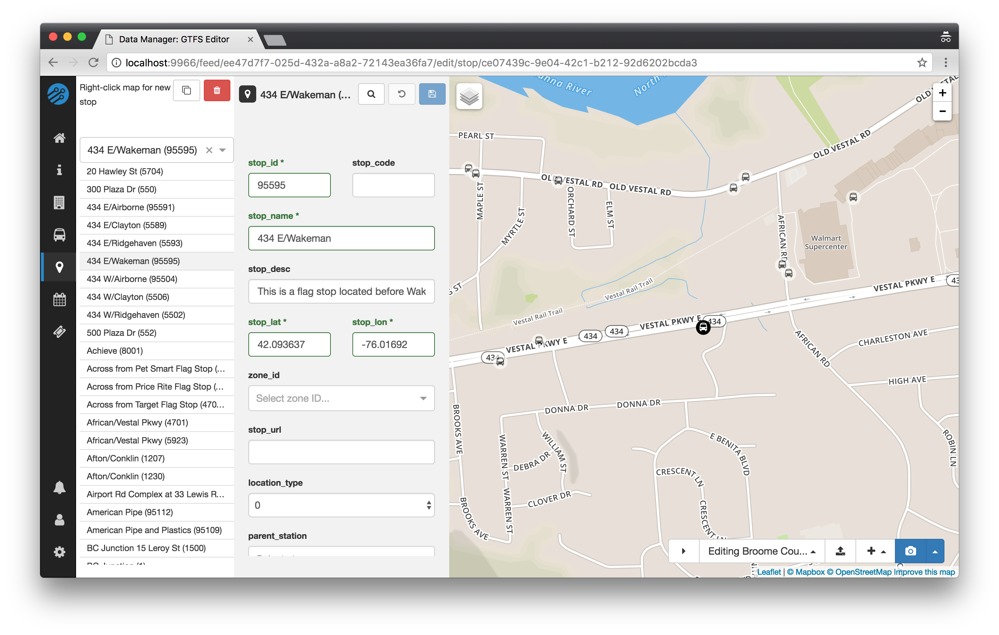
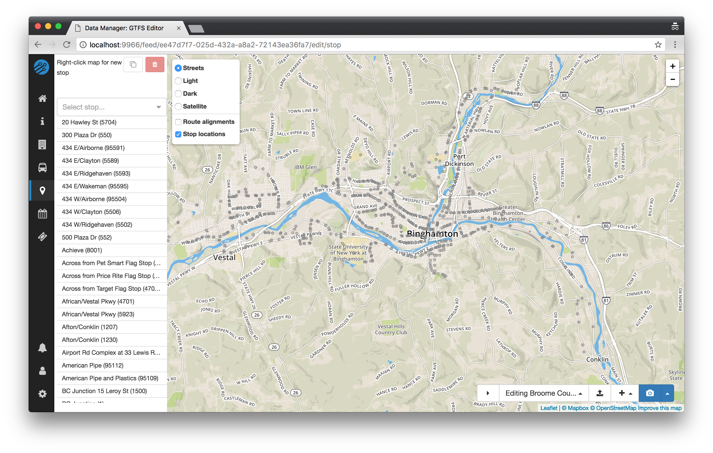

# Stops

## Editing stops

To begin editing stops, click the map marker icon button on the lefthand navigation bar.

## Selecting a stop

Choose a stop from the list or search by stop name in the dropdown.

You can also **zoom into the map** while the stop list is visible and once you're close enough you'll begin to see stops displayed. Click one to begin editing its details.

## Creating a stop: right-click on map

To create a new stop, **right-click on the map** in the location you would like to place the stop. **Note:** as with all newly created items (except patterns), the new stop will not be saved until the save icon (💾) is clicked.

## Moving a stop

To move a selected stop simply **click and drag the stop to the new location**. Or, if already you know the latitude and longitude coordinates, you can copy these into the text fields. After moving the stop, click save to keep the changes.

<!-- ## Stop details

- Name – the name of the stop
- Other information – for any other details you may want to note down about the stop -->

## View all stops for feed

To view all stops for a feed, hover over the map layers icon (in the top, lefthand corner of the map) and turn on the `Stop locations` layer. When you do, you'll see all of the stops (which appear as grey circles) for the feed even at wide zoom levels. This layer can be viewed whether or not the stop list is visible, so it can be helpful for users who would like to view stop locations alongside routes or trip patterns.

Clicking on a stop shown in this layer will select the stop for editing, but be careful—it can be tricky to select the right stop from very far away!

<!-- Need to add feature -->
<!-- Merge/Manage Stops – By clicking the ‘Find Duplicate Stops’ button all stops within 15 meters of
each other will become highlighted as a group. After clicking on a highlighted group you will have
the option to merge the stops. -->
