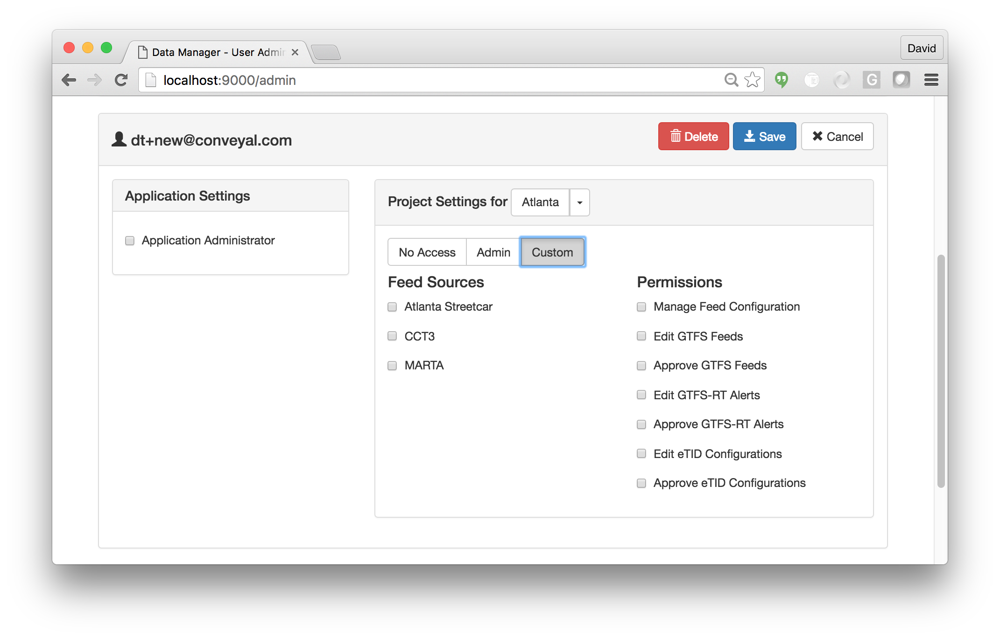
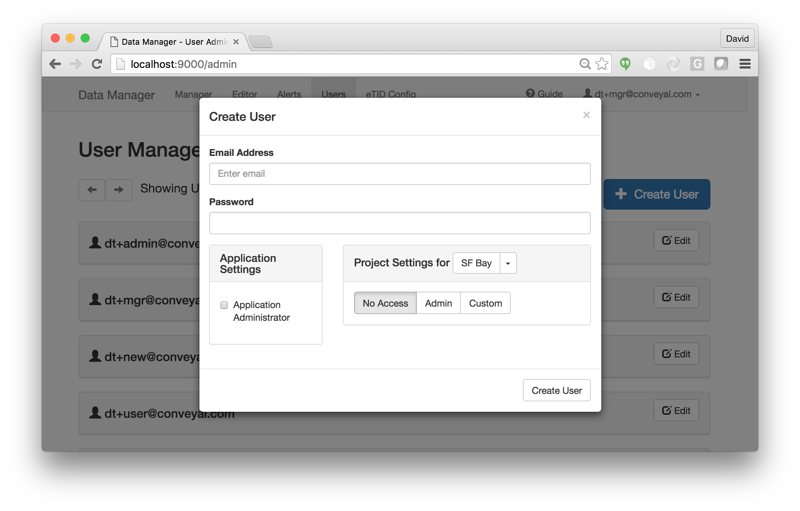

# Managing Users

## Overview

User accounts in the Transit Data Tools suite are managed via Auth0, a third-party authentication service. (For details on setting up Auth0 for use with this application, see the Deployment documentation.)

Auth0 allows for access via internally defined user accounts as well as third-party identity providers (e.g. social networking sites); this documentation deals with internal accounts only. Internal accounts use username-password authentication, with a user's email address serving as the unique username.

## User Permissions

The Data Tools suite uses a system of user permissions to regulate access to various functions within the application. Two types of administrator-level users exist:

- **Application-level administrator**: has full access to the Data Tools suite, including access to all projects and feed sources, the ability to create new projects, and the ability to create and manage users.
- **Project-level administrator**: has full access to a single project, including all project-level permissions. Is not able to create new projects or administer users.

For non-administrative users, permissions may be assigned on an individual basis. A non-administrative user's permissions can also be set to only apply to particular feeds within a project (note that all users have read-only access to all feeds by default).

## Managing Users

To create or manage users, you must be logged in as and application-level administrator. Click the "User" tab at the top navigation bar to access the user management console. You will then see a list of all users in the system:

Click a user name to see an expanded user profile where specific permissions can be set:

To create a new user, click the "Create User" button:

 You will be asked to provide an email address (which serves as the user's username), an initial password for the user, and any initial permission settings. Once created, the user will receive a confirmation email at the specified email address.
