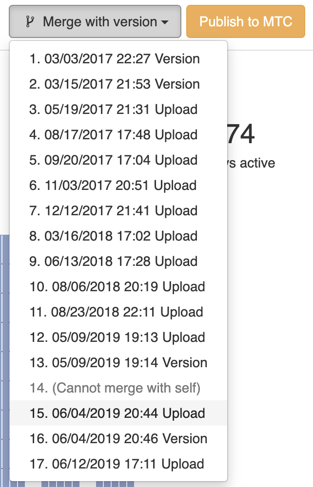
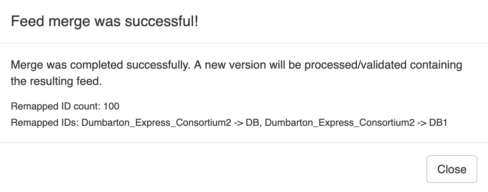

# Merging Feeds

## Merging active and future Feed Versions
For a given feed source/agency, it is possible to merge two feed versions that represent different service periods during the calendar year, e.g., a feed that contains summer service and a feed that contains fall service. This feature provides a convenient way for agencies to publish a feed version that spans a longer service period without interrupting downstream services (e.g., trip planners) that rely on that data day in and day out.

To begin a feed merge, navigate to one of the feed versions to be merged (it does not matter whether this is the current or future version). Next, click the 'Merge with version' dropdown button and select the version with which to merge.

  

### Merge rules
We call "active" and "future" GTFS feeds the feeds with the earliest and latest start dates, respectively.
This is in reference to the typical use case where, to avoid disruptions to trip planning software,
a feed with service that starts in the future needs to be merged with a feed with active service that has not expired yet.  

There are a set of rules that govern the requirements for input feed versions and how different tables are merged in the output feed version:

1. Merging will be based on `route_short_name` in the current and future datasets. All matching
  `route_short_names` between the datasets shall be considered same route. Any `route_short_name`
  in active data not present in the future will be appended to the future routes file.
1. Future `feed_info.txt` file should get priority over active feed file when difference is
  identified.
1. When a difference is found in `agency.txt` between the active and future feeds, the future
  `agency.txt` file data should be used. If `agency_id` is not specified (e.g. because a feed only has one agency),
  one is automatically generated for the merged feed.
1. Stops will be merged on `stop_code` or `stop_id` if `stop_code` is missing. However, some restrictions apply on
  when missing stop_code values are permitted:

    (i) Stops with `location_type` greater than `0` (i.e., anything but `0` or `empty`) are permitted
    to have empty `stop_codes` (even if there are other stops in the feed that have
    `stop_code` values). This is because these `location_type`s represent special entries
    that are either stations, entrances/exits, or generic nodes (e.g., for
    `pathways.txt`). The merge will happen on `stop_code` if provided, or fallback on `stop_id`.
    
    (ii) For regular stops (`location_type = 0` or empty), all or none of the stops must
    contain `stop_codes`. Otherwise, the merge feeds job will be failed.

1. Trips will be merged as follows:

    (i) All `trip_id`s from one version that are not in the other version will be added to the merged feed.

    (ii) Reusing `trip_id`s between the feed versions is permitted,
    however the **trip signature** must all be identical in both feeds.
    Two trips have the same signature if all their `arrival_time`, `departure_time`, `stop_id`, and `stop_sequence`
    fields in `stop_times.txt` are exactly the same in both feeds. If a time, stop, or stop sequence is changed on a trip,
    the trip will have a different signature.
      
    If a single trip signature changes, the merge process will fail and report the `trip_id`s with mismatching signatures.

2. Calendar entries are added with some modifications.

    (i) For trips with `trip_id` in the active feed and not in the future feed, the corresponding service entry
    in `calendar.txt` in the active feed is kept and renamed. The reference in the trip entry is updated accordingly.
    If that service ends after the future feed start date, it is set to end one day before the future feed start date.

    (ii) For trips with the same signature and with `trip_id` found in both feeds, a new entry in `calendar.txt` is created,
    starting from the active feed’s start date and ending at future feed’s end date.
    These trips will be assigned under the new record in `calendar.txt`.

    (iii) For trips with `trip_id` only in the future feed, the service entry in `calendar.txt` from the future feed is added.

    (iv) Entries from the active feed's `calendar_dates` and `calendar_attributes` that are after the start of the future feed,
    or entries that become unreferenced are removed.

1. New `shape_ids` in the future datasets should be appended in the merged feed.
1. Merging `fare_attributes` will be based on `fare_id` in the current and future datasets. All
  matching `fare_ids` between the datasets shall be considered same fare. Any `fare_id` in active
  data not present in the future will be appended to the future `fare_attributes` file.
1. All fare rules from the future dataset will be included. Any identical fare rules from
  the current dataset will be discarded. Any fare rules unique to the current dataset will be
  appended to the future file.
1. All `transfers.txt` entries with unique stop pairs (from - to) from both the future and
  current datasets will be included in the merged file. Entries with duplicate stop pairs from
  the current dataset will be discarded.
1. All GTFS+ files should be merged based on how the associated base GTFS file is merged. For
  example, directions for routes that are not in the future `routes.txt` file should be appended
  to the future `directions.txt` file in the merged feed.

### Merge Feed Versions Result
Once the merge feeds task has been completed, a notification window will appear describing the results of the merge process. If the feeds did not meet the rules for input datasets, the merge will fail and you will see a message describing the reason for failure and any offending records (e.g., duplicate `trip_ids` shared between the feeds). Otherwise, you will see a success message, with a list of any IDs that were modified for the output feeds (note: the input feeds will never be modified). Upon success, a new Feed Version will be created as the latest version for the feed source.

  

## Merging a Project's Feed Versions
Another feed merge type supported by the application is to merge the latest version for all feed sources in a project. This process only supports a basic "dumb" merge, where all unique identifiers from the input feeds will be feed-scoped. In other words, a `stop_id` value of `12345` in an AC Transit input feed, will appear as `AC_12345` in the output feed (this prefix may differ in practice). Also, the regional merge currently makes no attempt to merge stop entities from different feeds based on location.

A regional merge can be performed by clicking `Actions > Merge all` on the project view (list of feed sources). This may take some time depending on the number and size of feeds in the project and is not recommended for projects with a large number of very large feeds.
