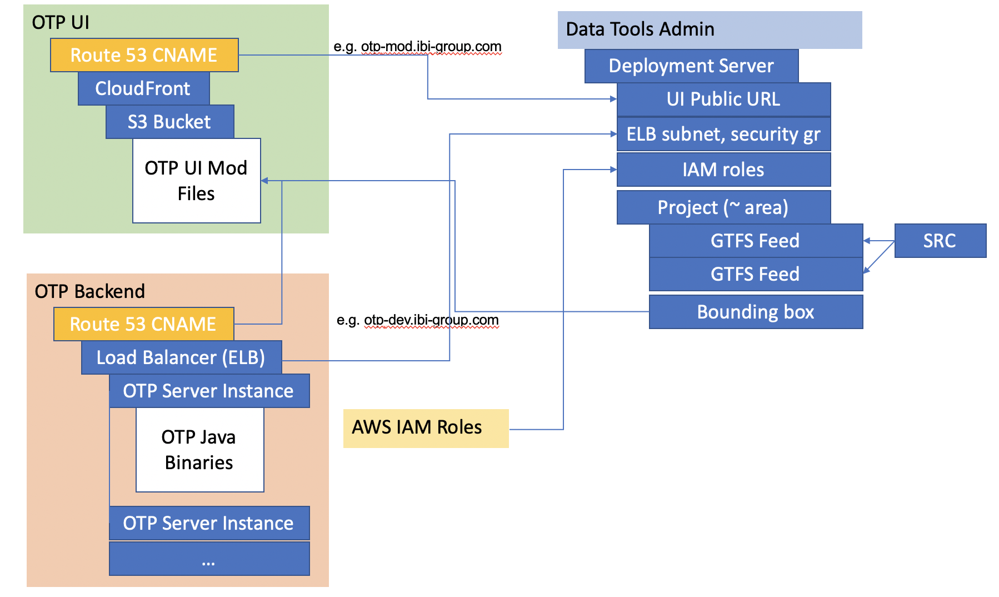

# OTP Deployment Guide

In this guide:

- [OTP Deployment Guide](#otp-deployment-guide)
  - [Overview](#overview)
  - [OTP Deployment Architecture](#otp-deployment-architecture)
  - [Performing an OTP Deployment](#performing-an-otp-deployment)

## Overview

This guide describes how to configure and deploy OTP servers using OTP Data Tools, and is for intermediate to advanced OTP Data Tools administrators.

The deployment architecture diagram below depicts how OTP servers are managed by Data Tools and can be used with elastic load balancers. The user interface is deployed on Amazon S3 servers and optionally mirrored by CloudFront, a high-bandwidth content delivery mechanism. Data Tools prepares and sends a data bundle and configuration properties to initialize OTP servers. The data bundle includes a set of GTFS feeds and OpenStreetMap data. DataTools makes the request to the osm-lib server and then creates a bundle of the resulting OSM and GTFS data. Data Tools does not manage UI deployments at this time.

The steps to perform an OTP deployment describe how to set up and link OTP servers to load balancers, S3 servers to CloudFront, and tie these various AWS resources in Data Tools. Administrators can also find how to configure optional subdomains (i.e. public URLs) for OTP servers.

## OTP Deployment Architecture

The figure below depicts the OTP deployment architecture.

[Source link](https://ibigroup-my.sharepoint.com/:p:/p/binh_dam/EV_e-3qGZzxIgxJy06StsuIB8TW1A50D_DeKF-aV99jIVQ?e=GMjMh7)

## Performing an OTP Deployment

1. [Setting up OTP UI and backend servers on AWS](./setting-up-aws-servers.md)
2. [Adding a deployment server from Data Tools](./add-deployment-server.md)
3. [Deploying GTFS feeds to OTP](./deploying-feeds.md)
