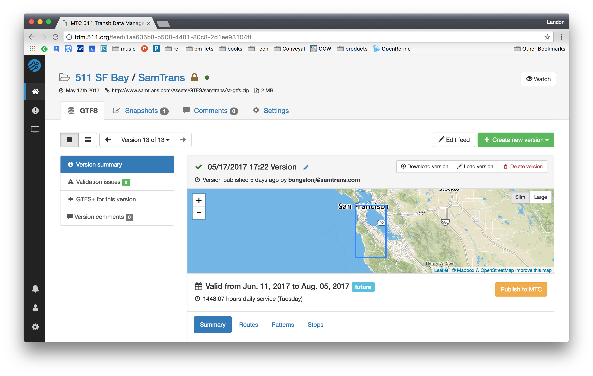
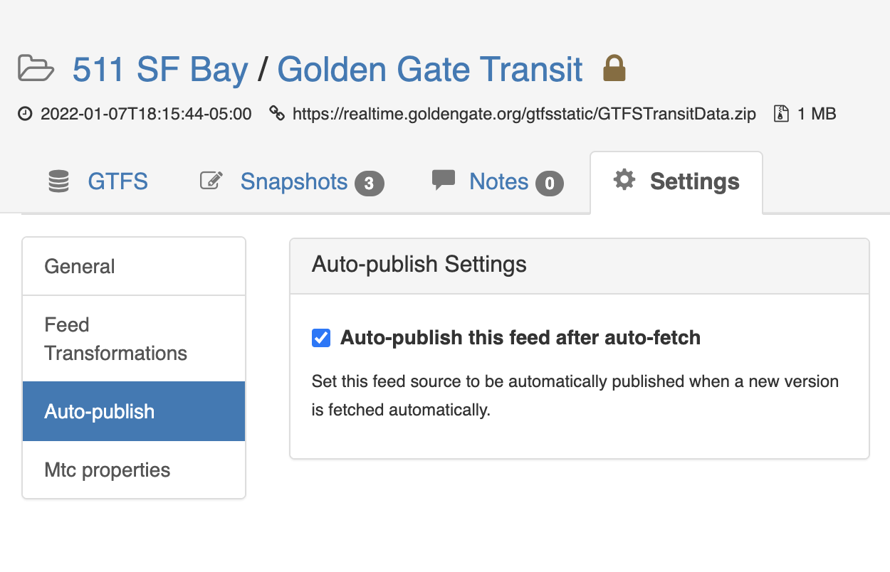
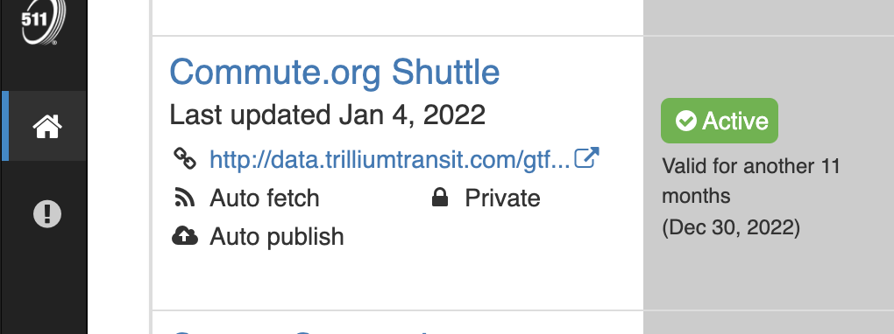
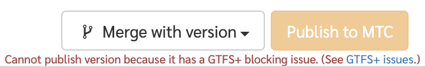
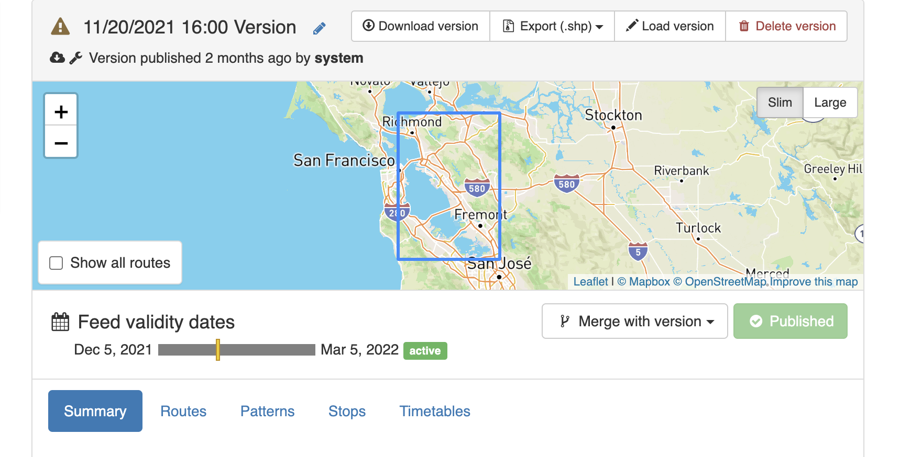

# Publishing Feeds

## Publishing a Feed Version Manually

Once a feed version has been loaded into the manager either through direct upload, URL fetch or loaded from the editor, in order to make this feed active (i.e., available for creating alerts or visible in other 511 systems) you must first publish the feed.  This step allows users to review the feed contents (such as number of routes or stops) as well as any validation issues before beginning the publication process.

Once you have checked these details, you must click the yellow `Publish to MTC` button.

## Auto Publishing Feed Versions Fetched Automatically

To avoid repeating the manual publishing steps above, 
you can set up auto publishing for feeds that are to be fetched automatically.

When creating new feeds, the auto-publishing setting is under the `Automatic publishing` section.
For existing feeds, the auto-publishing setting is found under the `Settings` tab, `Auto-publish` category.

In the list of feed sources, feeds that are set to be auto-published have an indicator displayed below the feed name.

Auto-publishing will occur immediately after the feed is auto-fetched,
at the time set under the project's auto-fetch settings and at the frequency set for the feed source.

If an auto-fetched feed version has a blocking issue (see below), that feed version will not be automatically published,
and you must correct the issues and publish the feed manually instead.

## Feed Publication Blocking Issues
There are a number of validation issues for both standard GTFS files and GTFS+ files that will disable the `Publish to MTC` button. When there is a blocking issue, a message will appear below the publish button giving a general description of why you cannot publish the feed. Generally, you will need to review the standard GTFS validation issues or the GTFS+ issues (you can view these by selecting the appropriate tab in the vertical nav bar on the lefthand side of the screen) and fix the issues with either the in-app editors or by re-importing a valid version. Once all of the blocking issues are resolved, the publish button will be enabled, allowing you to publish the new dataset.

### List of blocking issues
The following issues will prevent a feed version from being published. They must be fixed either in the in-app editors or externally fixed and re-uploaded before the feed version can be published.

- **Standard GTFS files** - only certain issues will prevent publication, including:
    1. When fatal exceptions were encountered in loading or validating the GTFS file (i.e., critical, structural issues with the feed).
    1. **Illegal Field Value** - Fields may not contain tabs, carriage returns or new lines.
    1. **Table in Subdirectory** - Rather than being at the root of the zip file, a table was nested in a subdirectory.
    1. **Wrong Number of Fields** - A row did not have the same number of fields as there are headers in its table.
    1. **Missing Column** - A required column was missing from a table.
    1. **Table Missing Column Headers** - A table is missing column headers.
    1. **Referential Integrity** - A line references an ID that does not exist in the target table.
- **GTFS+ files** - any issue detected with GTFS+ files or field values will prevent publication, including:
    1. Invalid or misspelled field headers
    1. Incorrect number of fields for a particular row
    1. Invalid value for a particular field
    1. Missing required fields or values

## After Publishing
After selecting a version to be published, the GTFS feed begins processing by 511 systems. This process may take some time to fully complete, but the yellow `Publish to MTC` button will change to green indicating which version is active for a given agency/feed source.

This workflow supports uploading future versions of GTFS, for example, a GTFS feed that does not become active until the next service change. It also allows you to revert to previous versions of GTFS should issues be identified with the currently active feed version.

